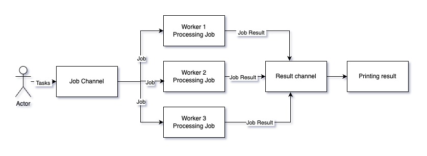

### What is worker pool pattern?

The Worker Pool pattern is a concurrency pattern in Go that allows you to manage and control the number of goroutines working on a set of tasks. This pattern is particularly useful when you have a large number of tasks to process and want to limit the number of concurrent goroutines to prevent excessive resource usage.



<!--truncate-->

### The basic flow of the worker pool pattern looks like this:

```go
package main

func main() {
	numJobs := 10
	numWorkers := 3


	// Create job and result channels
	
	// Start the worker pool

	// Submit jobs to workers

	// Collect results

	// Wait for all goroutines to finish
}
```

### Here is the final code implementing the Worker Pool pattern:

Collects results in a separate goroutine. 

```go 
package main

import (
	"fmt"
	"sync"
	"time"
)

type Job struct {
	Id    int
	value int
}

type WorkerPool struct {
	numJobs    int
	numWorkers int
	jobs       chan Job
	results    chan int
	wg         sync.WaitGroup
}

func newWorkerPool(numJobs int, numWorkers int) *WorkerPool {
	return &WorkerPool{
		numJobs:    numJobs,
		numWorkers: numWorkers,
		jobs:       make(chan Job, numJobs),
		results:    make(chan int, numJobs),
	}
}

func (workerPool *WorkerPool) startWorker() {
	defer workerPool.wg.Done()

	for job := range workerPool.jobs {
		time.Sleep(time.Second) // Simulate work
		workerPool.results <- job.value
	}
}

func (workerPool *WorkerPool) startWorkers() {
	for i := 0; i < workerPool.numWorkers; i++ {
		workerPool.wg.Add(1)
		go workerPool.startWorker()
	}
}

func (workerPool *WorkerPool) submitJobs() {
	for i := 0; i < workerPool.numJobs; i++ {
		workerPool.jobs <- Job{Id: i, value: i}
	}

	close(workerPool.jobs) // Close jobs channel to signal workers no more jobs
}

func (workerPool *WorkerPool) collectResult(wg *sync.WaitGroup) {
	defer wg.Done()
	for result := range workerPool.results {
		fmt.Println(result)
	}
}

func main() {
	numJobs := 10
	numWorkers := 3

	var wg sync.WaitGroup

	// Create job and result channels
	workerPool := newWorkerPool(numJobs, numWorkers)

	// Start the worker pool
	workerPool.startWorkers()

	// Submit jobs to workers
	workerPool.submitJobs()

	// Collect results
	wg.Add(1)
	go func() {
		workerPool.collectResult(&wg)
	}()

	// Wait for all workers to finish
	workerPool.wg.Wait()

	// Close results channel after all workers are done
	close(workerPool.results)

	// Wait for all results to be collected
	wg.Wait()
}

```