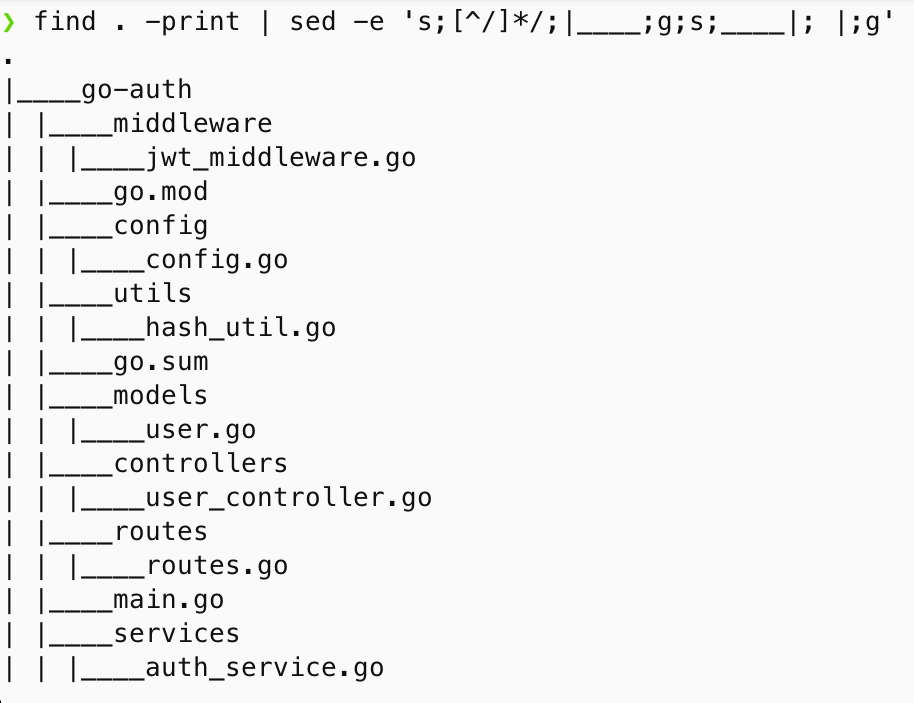

We planned to use following libraries:

1. Gin: http web framwork
go get -u github.com/gin-gonic/gin

2. Gorm: ORM for relational database
go get -u gorm.io/gorm

3. go-jwt
github.com/golang-jwt/jwt

4. bycrypt:
5. godotenv:
6. Postgres database
go get -u gorm.io/driver/postgres

Directory structure is as following




models/user.go

```go
package models

import "gorm.io/gorm"

type User struct {
	gorm.Model

	Name     string `json:"name"`
	Email    string `json:"email"`
	Password string `json:"password"`
	Role     string `json:"role"`
}

```
