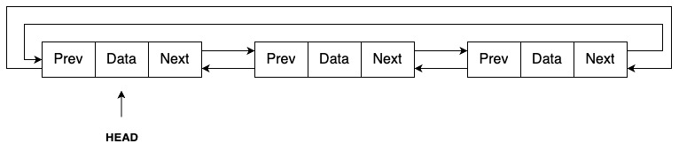

---

sidebar_position: 4

---

# Circular Linked List

A Circular Linked List is a variation of the linked list where the last node's pointer points back to the first node, creating a circular structure. This unique arrangement allows continuous traversal of the list, either in one direction (for singly linked lists) or in both directions (for doubly linked lists).



### Types of Circular Linked Lists

1. **Circular Singly Linked List**: Each node contains data and a pointer to the next node. The last node’s pointer points back to the head of the list.

2. **Circular Doubly Linked List**: Each node has three fields: data, a pointer to the next node, and a pointer to the previous node. The last node’s `next` pointer points to the head, and the head’s `prev` pointer points to the last node.

### Structure of a Circular Linked List

In Go, a Circular Linked List can be implemented using structs to represent the nodes and the list itself.

**Node struct**

The `Node` struct holds the data and pointers to the next (and previous) nodes in the list.

```go
type Node struct {
    data int
    next *Node
    prev *Node  // Used only for circular doubly linked list
}
```

**CircularLinkedList struct**

The `CircularLinkedList` struct manages the list and typically contains a reference to the head node.

```go
type CircularLinkedList struct {
    head *Node
}
```

### Basic Operations on a Circular Linked List

To work with a Circular Linked List, essential operations such as inserting a node and printing the list's contents are needed. Below is the outline for these operations in Go.

### Circular Singly Linked List Implementation

Let's first explore the implementation of a Circular Singly Linked List in Go.

```go
package main

import "fmt"

// Node represents an element in the circular singly linked list
type Node struct {
    data int
    next *Node
}

// CircularLinkedList represents the circular singly linked list
type CircularLinkedList struct {
    head *Node
}

// Insert a new node at the end of the list
func (list *CircularLinkedList) insertNode(data int) {
    newNode := &Node{data: data}

    if list.head == nil {
        list.head = newNode
        newNode.next = list.head
    } else {
        current := list.head
        for current.next != list.head {
            current = current.next
        }
        current.next = newNode
        newNode.next = list.head
    }
}

// Print all nodes in the list
func (list *CircularLinkedList) printList() {
    if list.head == nil {
        fmt.Println("List is empty")
        return
    }

    current := list.head
    for {
        fmt.Print(current.data, " ")
        current = current.next
        if current == list.head {
            break
        }
    }
    fmt.Println()
}

func main() {
    list := CircularLinkedList{}

    list.insertNode(10)
    list.insertNode(20)
    list.insertNode(30)
    list.printList() // Output: 10 20 30
}
```

### Circular Doubly Linked List Implementation

Next, let’s implement a Circular Doubly Linked List in Go.

```go
package main

import "fmt"

// Node represents an element in the circular doubly linked list
type Node struct {
    data int
    next *Node
    prev *Node
}

// CircularDoublyLinkedList represents the circular doubly linked list
type CircularDoublyLinkedList struct {
    head *Node
}

// Insert a new node at the end of the list
func (list *CircularDoublyLinkedList) insertNode(data int) {
    newNode := &Node{data: data}

    if list.head == nil {
        list.head = newNode
        newNode.next = list.head
        newNode.prev = list.head
    } else {
        tail := list.head.prev
        tail.next = newNode
        newNode.prev = tail
        newNode.next = list.head
        list.head.prev = newNode
    }
}

// Print all nodes in the list
func (list *CircularDoublyLinkedList) printList() {
    if list.head == nil {
        fmt.Println("List is empty")
        return
    }

    current := list.head
    for {
        fmt.Print(current.data, " ")
        current = current.next
        if current == list.head {
            break
        }
    }
    fmt.Println()
}

func main() {
    list := CircularDoublyLinkedList{}

    list.insertNode(10)
    list.insertNode(20)
    list.insertNode(30)
    list.printList() // Output: 10 20 30
}
```

### Key Points to Remember

- In a **Circular Singly Linked List**, the `next` pointer of the last node points to the `head`, creating a circular connection.
- In a **Circular Doubly Linked List**, both the `next` pointer of the last node and the `prev` pointer of the `head` connect back to each other, enabling traversal in both directions.

Circular Linked Lists are particularly useful in scenarios where you need to loop through the data structure continuously, such as in round-robin scheduling or managing a playlist.

For more detailed code examples, check out my GitHub repository: [Circular Linked List in Go](https://github.com/shekhar-patil/data_structure_and_algorithms/blob/main/data_structures/linked_list/golang/circular_linked_list.go).
