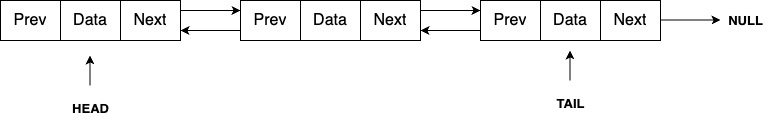

---

sidebar_position: 3
---

# Doubly Linked List

The diagram above shows a Doubly Linked List. It holds data, along with the addresses of both the next and previous nodes, allowing traversal in both forward and backward directions.

