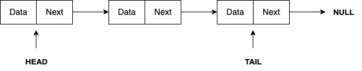

---

sidebar_position: 1

---

# Linked List

A linked list is a linear data structure made up of a sequence of connected nodes. The first node is called the Head, while the last node is referred to as the Tail. In both singly and doubly linked lists, the Tail typically points to NULL.

There are three primary types of linked lists:

- **1.** [Singly Linked List](singly-linked-list.md)
- **2.** [Doubly Linked List](doubly-linked-list.md)
- **3.** [Circular Linked List](circular-linked-list.md)

### Singly Linked List

A Singly Linked List contains data and the address of the next node. This structure allows traversal only in the forward direction, with no ability to move backward.

---------

### Doubly Linked List

The diagram above shows a Doubly Linked List. It holds data, along with the addresses of both the next and previous nodes, allowing traversal in both forward and backward directions.

---------

### Circular Linked List

A Circular Linked List can be either singly or doubly linked. Unlike other types, the Tail of the list points back to the Head instead of pointing to NULL.

---

You can explore each of these types in greater detail in the following sections, which include code implementations in Golang.

