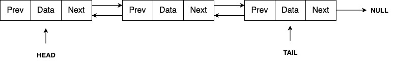
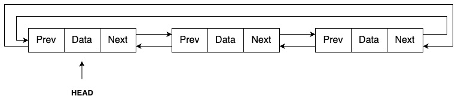

---

sidebar_position: 1

---

# Linked List

A linked list is a fundamental linear data structure composed of a series of interconnected nodes. Each node contains two main elements: data and a reference (or pointer) to the next node in the sequence. The first node in the list is known as the Head, while the last node is referred to as the Tail. In most linked lists, the Tail points to `NULL`, indicating the end of the list.

Linked lists are essential in computer science due to their dynamic nature, allowing efficient insertion and deletion of elements. They come in various forms, each offering unique traversal capabilities and use cases.

## Types of Linked Lists

There are three primary types of linked lists:

1. **[Singly Linked List](singly-linked-list.md)**
   A Singly Linked List consists of nodes, where each node contains the data and a pointer to the next node in the sequence. This structure permits traversal only in one direction—forward—from the Head to the Tail.

2. **[Doubly Linked List](doubly-linked-list.md)**
   A Doubly Linked List extends the functionality of a singly linked list by including an additional pointer in each node that points to the previous node. This allows traversal in both forward and backward directions, providing more flexibility in data manipulation.

3. **[Circular Linked List](circular-linked-list.md)**
   A Circular Linked List can be either singly or doubly linked. The key characteristic of this type is that the Tail node, instead of pointing to `NULL`, points back to the Head node, forming a continuous loop. This makes circular traversal of the list possible.

---

### Singly Linked List

A Singly Linked List is a linear data structure where each node contains a piece of data and a reference to the next node in the list. The traversal is unidirectional, starting from the Head and moving towards the Tail. Once you reach the Tail, the traversal ends as the next reference points to `NULL`.

### Doubly Linked List

In a Doubly Linked List, each node contains data, a pointer to the next node, and a pointer to the previous node. This structure allows traversal in both forward and backward directions, making it easier to navigate and manipulate the list from any given node.

### Circular Linked List

A Circular Linked List differs from the other types by connecting the Tail node back to the Head node, forming a circular loop. This structure can be implemented as either a singly or doubly linked list. Circular Linked Lists are particularly useful in scenarios where the list needs to be looped through repeatedly without requiring a reset to the Head.

---

You can dive deeper into each type of linked list in the following sections. Each section provides detailed explanations and code implementations using Golang, helping you understand their practical applications and nuances.
