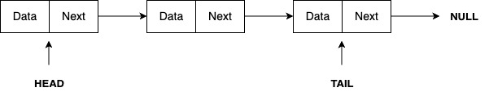

---

sidebar_position: 2

---

# Singly Linked List

A Singly Linked List is a fundamental data structure where each node contains two fields: data and a pointer to the next node in the sequence. This structure allows for traversal in a single direction—from the head (the first node) to the tail (the last node)—but does not permit backward traversal.



### Structure of a Singly Linked List

In Go, a Singly Linked List is typically implemented using two structs: one to represent the individual nodes of the list and another to manage the list as a whole.

**Node struct**
The `Node` struct holds the data and a reference (`next`) to the next node in the list.

```go
type Node struct {
  data int
  next *Node
}
```

**LinkedList struct**
The `LinkedList` struct manages the entire list and typically contains a reference to the head node.

```go
type LinkedList struct {
  head *Node
}
```

### Basic Operations on a Singly Linked List

To work with a Singly Linked List, we need to define several essential operations such as inserting a node, deleting a node, and printing the list's contents. Below is an outline of these operations using pseudo-code in Go.

```go
package main

// import necessary packages

type Node struct {
  data int
  next *Node
}

type LinkedList struct {
  head *Node
}

func (list *LinkedList) insertNode(data int) {
  // Code to insert a node into the list
}

func (list *LinkedList) deleteNode(val int) {
  // Code to delete a node from the list
}

func (list *LinkedList) printList() {
  // Code to print all nodes in the list
}

func main(){
  list := LinkedList{}

  list.insertNode(10)
  list.deleteNode(10)
  list.insertNode(20)
  list.insertNode(30)
  list.printList()
}
```

### Implementing the Operations

Let's dive into the actual implementation of the `insertNode`, `deleteNode`, and `printList` functions:

```go
package main

import "fmt"

// Node represents an element in the linked list
type Node struct {
  data int
  next *Node
}

// LinkedList represents the singly linked list
type LinkedList struct {
  head *Node
}

// Insert a new node at the end of the list
func (list *LinkedList) insertNode(data int) {
  newNode := Node{data: data}

  if list.head == nil {
    list.head = &newNode
  } else {
    current := list.head
    for current.next != nil {
      current = current.next
    }
    current.next = &newNode
  }
}

// Delete a node by value from the list
func (list *LinkedList) deleteNode(val int) {
  if list.head == nil {
    fmt.Println("List is empty")
    return
  }

  if list.head.data == val {
    list.head = list.head.next
    return
  }

  current := list.head
  for current.next != nil && current.next.data != val {
    current = current.next
  }

  if current.next != nil {
    current.next = current.next.next
  } else {
    fmt.Println("Node with value", val, "not found")
  }
}

// Print all nodes in the list
func (list *LinkedList) printList() {
  if list.head == nil {
    fmt.Println("List is empty")
    return
  }

  current := list.head
  fmt.Println("List data:")
  for current != nil {
    fmt.Print("-->", current.data)
    current = current.next
  }
  fmt.Println()
}

func main() {
  list := LinkedList{}

  list.insertNode(10)
  list.deleteNode(10)
  list.insertNode(20)
  list.insertNode(30)
  list.printList()
  list.deleteNode(30)
  list.printList()
  list.insertNode(40)
  list.printList()
  list.deleteNode(30)
  list.printList()
}
```

This Go code demonstrates how to manage a Singly Linked List by inserting and deleting nodes, as well as printing the list’s contents.

For a more detailed exploration and code examples, you can check out my work on GitHub: [Singly Linked List in Go](https://github.com/shekhar-patil/data_structure_and_algorithms/blob/main/data_structures/linked_list/golang/singly_linked_list.go).
